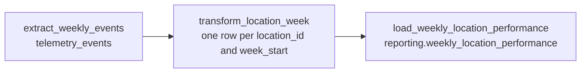

# Weekly Location Cost & Waste Report

Design for Mariana's weekly business report. The runnable entry is `data/pipelines/pipeline.py`. `services/telemetry/analysis.py` and `GET /telemetry/report` stay as they are. This pipeline reads `telemetry_events` and writes `reporting.weekly_location_performance`.

The business brief is [`docs/pipelines/CONTEXT-company.md`](../../docs/pipelines/CONTEXT-company.md). The mandatory events are the ones in [`docs/telemetry/CONTEXT-company.md`](../../docs/telemetry/CONTEXT-company.md).

## Current State

Brasaland already captures backoffice telemetry and stores it in Supabase table `telemetry_events`. The table is append-only: `event_id` is the primary key, and update and delete triggers reject changes. A batch lands through `POST /telemetry/events`. One insert stores the valid rows. A repeated `event_id` is counted as rejected and is not stored again.

Columns used by this pipeline:

| Column | Role |
| --- | --- |
| `event_id` | Dedup key. Comes from the envelope `eventId`. |
| `timestamp` | UTC event time. This is the clock for the ISO week. |
| `event_type` | Which mandatory metric fired. |
| `tags` | Allowlisted properties: `location_id`, `country`, `currency`, `quantity`, `unit_cost`, and the fields that belong to that event type. |

Events already captured that this report cares about:

| `event_type` | What is stored today |
| --- | --- |
| `inbound_order_created` | Location, country, product, quantity, and `unit_cost` in COP or USD. |
| `stock_waste_registered` | Location, country, quantity, and reason (`expired`, `kitchen_error`, `theft_suspected`). `unit_cost` is now on the capture allowlist so waste can be priced. Rows stored before that field have no cost. |
| `stock_threshold_triggered` | A location's ingredient fell below its minimum. |
| `ingredient_price_variance_detected` | An inbound unit cost moved more than 10% from the prior median for that product and supplier. |
| `outbound_order_created` | Preparation consumption. Not one of the five KPIs. Kept in the extract so a week with exits and no purchases is visible as context. |

`GET /telemetry/report` already answers engineering questions for a UTC window: `events_per_day`, `error_rate_by_type`, `auth_failure_rate`, and `latency_by_route`. Those numbers describe volume, failures, login health, and route latency. They are not grouped by location or week, and they do not sum money.

## Business gap

Mariana (CEO) and Felipe (Operations Director) still cannot see, for each of the 14 locations and each week, how much that kitchen spent, how much it wasted, whether waste is large relative to its own purchases, how often stock fell below the minimum, or how often a supplier price spiked. Lucía needs the purchase and price figures for supplier talks. The technical report does not answer that. That is why this pipeline exists.

## Purpose

This pipeline produces Mariana's Weekly Location Cost & Waste Report every Monday: Purchase Cost per Location, Waste Cost per Location, Waste Ratio, Stockout Frequency, and Price Alert Frequency, computed from `inbound_order_created`, `stock_waste_registered`, `stock_threshold_triggered`, and `ingredient_price_variance_detected`.

## Run

Monday 11:00 UTC (06:00 Colombia, 07:00 Florida). The run recomputes the ISO week that just ended.

From the repo root, with the API environment (Prefect is installed there):

```bash
services/api/.venv/bin/python data/pipelines/pipeline.py
```

That is the entry point behind `python data/pipelines/pipeline.py`. An optional `YYYY-MM-DD` argument recomputes that week instead of the week that just ended. The same run is what `POST /reporting/pipeline-runs` starts.

## Extraction format

Source table: `telemetry_events` only. Inventory order tables are not a second source. The event is the audit record.

Each extracted row is one stored event:

- `event_id` text
- `timestamp` timestamptz, UTC
- `event_type` text, limited to the five types in the table above
- `tags` jsonb. For a cost event the fields that matter are `location_id` (the location number `1`–`14`, stored as text in the reporting row), `country` (`CO` or `US`), `currency` (`COP` or `USD`), `quantity`, and `unit_cost`

Purchase cost for one event is `quantity * unit_cost` on `inbound_order_created`. Waste cost for one event is `quantity * unit_cost` on `stock_waste_registered`. Stockout Frequency is a count of `stock_threshold_triggered`. Price Alert Frequency is a count of `ingredient_price_variance_detected`. `outbound_order_created` is extracted for the run log and is not added into any KPI.

Cadence: the backoffice posts events continuously. This pipeline does not run on each post. It runs Monday at 11:00 UTC, which is 06:00 in Colombia and 07:00 in Florida, and it recomputes the ISO week that just ended. `week_start` is the Monday of that week in UTC. A manual trigger can recompute one named `week_start` when a late event arrives.

Events with a null `location_id`, a country that disagrees with the currency (`CO` must be `COP`, `US` must be `USD`), or a missing `unit_cost` on a cost event are not added into the money columns. Their count is kept on the run row so a zero cost is not mistaken for a skipped file.

## Data flow



1. **Extraction.** `extract_weekly_events` reads `telemetry_events` for one half-open UTC week: `timestamp >= week_start` and `timestamp < week_start + 7 days`, and `event_type` in the five types above. The query returns `event_id`, `timestamp`, `event_type`, and `tags`. It does not filter inside `tags`.
2. **Transformation.** `transform_location_week` drops a repeated `event_id`, derives `week_start`, and aggregates to the grain `location_id` + `country` + `week_start`. Measures are `total_purchase_cost`, `total_waste_cost`, `waste_ratio` (`total_waste_cost / total_purchase_cost`, or `0` when purchases are `0`), `stockout_events_count`, `price_alert_events_count`, and `currency`. COP and USD are never added into the same row.
3. **Load.** `load_weekly_location_performance` upserts those rows into `reporting.weekly_location_performance` and writes one row to `reporting.weekly_performance_run`.

## Updates to existing records

`telemetry_events` does not update. A correction shows up as a new event, or as a late event whose `timestamp` falls in an earlier week. The row that does change is the weekly rollup.

The concrete rule is an upsert on the table's unique key `(location_id, week_start)`:

```sql
insert into reporting.weekly_location_performance (
  location_id, country, week_start,
  total_purchase_cost, total_waste_cost, waste_ratio,
  stockout_events_count, price_alert_events_count,
  currency, computed_at
) values (...)
on conflict (location_id, week_start) do update set
  country = excluded.country,
  total_purchase_cost = excluded.total_purchase_cost,
  total_waste_cost = excluded.total_waste_cost,
  waste_ratio = excluded.waste_ratio,
  stockout_events_count = excluded.stockout_events_count,
  price_alert_events_count = excluded.price_alert_events_count,
  currency = excluded.currency,
  computed_at = excluded.computed_at;
```

The new values replace the old values. They are not added to them. `computed_at` is the last successful recompute. History of who ran the job sits in `reporting.weekly_performance_run`, not in a second copy of the KPI row.

`location_id` values are the location numbers already on the events (`1` through `14`), written as text because the destination column is `text`. The sample slug `medellin-centro` is not a Brasaland location id.

## Destination and endpoints

Destination table, named by the business brief: `reporting.weekly_location_performance`.

Audit table for this pipeline only: `reporting.weekly_performance_run`.

The business API is a new module, `services/reporting/`. It does not import `services/telemetry/` and it does not call `GET /telemetry/report`.

| Endpoint | Calls in `data/pipelines/` |
| --- | --- |
| `GET /reporting/weekly-location-performance` | `read_weekly_location_performance` |
| `GET /reporting/pipeline-runs/latest` | `latest_weekly_performance_run` |
| `POST /reporting/pipeline-runs` | `request_weekly_location_performance_run` |

`GET /reporting/weekly-location-performance` accepts optional `week_start` and defaults to the latest `week_start` already loaded. The body is the brief's shape: `week_start` plus `locations[]` with the five KPI fields and `currency`. `read_weekly_location_performance` is a query. It does not recompute.

## Idempotency

A second run after a load-phase failure produces the same KPI rows as a clean run of that same week.

`load_weekly_location_performance` writes the whole week in one database transaction: every location upsert, then the run row marked `Completed`. If the connection drops after location `1` is staged and before location `8` is staged, the transaction rolls back. `reporting.weekly_location_performance` still holds the previous successful week, or no row yet. The run row is then marked `Failed` in a new transaction, with `week_start` set and `records_loaded` at `0`.

The next run calls the same three tasks for that `week_start`. Extract reads the events again. Transform rebuilds every location from those events, using each `event_id` once. Load upserts the full set. Location `1` is replaced with the recomputed totals, not added to a half-written total. Locations that never landed are inserted. A clean run and this second run therefore write the same `total_purchase_cost`, `total_waste_cost`, `waste_ratio`, `stockout_events_count`, and `price_alert_events_count` for every location in that week.

## Execution log

Table: `reporting.weekly_performance_run`. One row per attempt. A recompute inserts a new row. It does not overwrite the previous attempt.

| Field | Type | Why it has to be kept |
| --- | --- | --- |
| `run_id` | `uuid` | Names this attempt so two Monday runs are not collapsed into one audit line. |
| `week_start` | `date` | Says which ISO week was rebuilt. Without it, a failure cannot be resumed. |
| `status` | `text` | `Running`, `Completed`, or `Failed`. This is how an empty report is told apart from a run that never finished. |
| `started_at` | `timestamptz` | When extract began. Compared with the next Monday run, a missing week shows up as a gap in these timestamps. |
| `ended_at` | `timestamptz` | When the run reached `Completed` or `Failed`. Null while `Running`. |
| `records_read` | `integer` | Events returned from `telemetry_events` for that week after the event-type filter. |
| `records_loaded` | `integer` | Location rows upserted. A `Completed` run with `records_read = 0` and `records_loaded = 0` is a real quiet week. |
| `events_skipped_missing_cost` | `integer` | Cost events left out of the money sums because `unit_cost` was absent. Stops a low waste total from hiding a capture gap. |
| `error_message` | `text` | The load or database error on `Failed`. Empty on `Completed`. |

## Prefect mapping

One flow: `weekly_location_performance`.

| Task | Stage |
| --- | --- |
| `extract_weekly_events` | Extraction from `telemetry_events`. |
| `transform_location_week` | Aggregation to `location_id` and `week_start`. |
| `load_weekly_location_performance` | Upsert into `reporting.weekly_location_performance` and the run row. |

States that matter in this phase: `Running` from the moment the flow takes the week lock until the load transaction commits, `Completed` when that commit succeeds, and `Failed` when extract or load raises or the lock is already held. A second flow for backfill is not part of this design. A late week is the same flow with an explicit `week_start`.

Prefect block: `brasaland-supabase`. It holds the Supabase transaction-pooler URI that the API already uses as `DATABASE_URL`. The password stays in the block, not in the flow file. No second database.

## Application integration

`services/reporting/` only starts a run or reads tables. The sums live in `data/pipelines/`.

- `GET /reporting/weekly-location-performance` imports `read_weekly_location_performance` and returns the loaded week. This is the query the later dashboard will call.
- `GET /reporting/pipeline-runs/latest` imports `latest_weekly_performance_run` and returns the newest `reporting.weekly_performance_run` row (`status`, `week_start`, `started_at`, `ended_at`, `records_read`, `records_loaded`, `error_message`).
- `POST /reporting/pipeline-runs` imports `request_weekly_location_performance_run`. That function asks Prefect to start `weekly_location_performance` for the given `week_start`, or for the week that just ended when the body omits it. The request returns the new `run_id`. It does not compute the KPIs inside the HTTP handler.

## Design questions

### Idempotency

**Duplicates at the source.** The dedup key is the envelope field `eventId`, stored as `telemetry_events.event_id`. The ingest insert uses `ON CONFLICT (event_id) DO NOTHING`, so the second copy of the same action is rejected at storage and never becomes a second row. `transform_location_week` also aggregates with one row per `event_id` before the sums, so a replayed extract cannot add the same delivery twice. Both layers are required: storage stops the duplicate from landing, and the transform stops a dirty extract from inflating `total_purchase_cost`.

**Re-run after failure.** Described in [Idempotency](#idempotency). The load transaction rolls back a partial week. The next run rebuilds that `week_start` from `telemetry_events` and upserts on `(location_id, week_start)`. The second run's KPI numbers match a clean run. The failed attempt remains as its own run row.

**Late events.** A delayed `inbound_order_created` keeps its original `timestamp`. The Monday job, or `POST /reporting/pipeline-runs` with that `week_start`, recomputes the whole week and upserts. `total_purchase_cost` becomes the new sum. It is not the old sum plus the late event on top. `computed_at` moves forward. The earlier `Completed` run row stays in `reporting.weekly_performance_run`, so the audit trail shows both the first publish and the correction.

### Observability

**Silence versus true absence.** Three different records:

- No row in `reporting.weekly_performance_run` for the expected Monday means the flow did not run.
- A `Failed` row means it ran and did not load.
- A `Completed` row with `records_read = 0` and `records_loaded = 0` means it ran and `telemetry_events` had none of the five event types in that week.

`events_skipped_missing_cost` above zero means events existed but could not be priced. That is not a quiet kitchen.

**Collection traceability.** The path is `eventId` → `telemetry_events.event_id` → `extract_weekly_events` (counted as `records_read` for that `week_start`) → `transform_location_week` (grain `location_id`, `week_start`) → `reporting.weekly_location_performance`. A gap is `records_read` greater than the number of events that qualified for the sums, with the difference explained by `events_skipped_missing_cost`. A burst is `records_read` far above the previous `Completed` week for the same pipeline. Interval drift is a `started_at` gap longer than seven days between scheduled `Completed` runs.

**Growth versus data loss.** Compare `records_read` and `total_purchase_cost` with the previous `week_start`. If both rise, the locations bought more or bought at a higher `unit_cost`. If `records_read` falls to zero while `GET /telemetry/report` still shows `events_per_day` for those dates, these business events stopped arriving and the KPI zero is a capture gap. If the ingest response reports `rejected` because `event_id` already existed, those copies were not added to the sums. Growth in `rejected` without growth in `records_read` is duplicate traffic, not more purchasing.

### Recoverability

**Database outage.** The checkpoint is the `reporting.weekly_performance_run` row: `status`, `week_start`, and `records_loaded`. The load is one transaction, so a dropped connection leaves no half-written location row. Resume is another run of `weekly_location_performance` for that same `week_start`. The upsert writes the full recompute.

**Frontend buffer.** The backoffice queue already holds events and retries `POST /telemetry/events`. This pipeline does not read the browser. The risk is a retry that mints a new `eventId` for the same click. That would look like two purchases. The capture layer owns that risk: it must resend the original `eventId`. After a row is stored, the pipeline only sees `telemetry_events`.

**Transmission retry.** The client sends the same body again when the call fails or the status is not HTTP 200. HTTP 200 with that `event_id` stored means the event is new. HTTP 200 with that `event_id` rejected on the primary-key conflict means it is already stored, and the client must not invent a new id. A server error or a dropped connection means retry the same body. The conflict path is what keeps a retry from double-counting inside `total_purchase_cost`.

### Cross-cutting

**Concurrent runs.** A Monday schedule and `POST /reporting/pipeline-runs` can both target the same `week_start`. What we observe is two `Running` rows for that week. `request_weekly_location_performance_run` takes a Postgres advisory lock keyed by `week_start` before it marks a run `Running`. The second caller does not start `weekly_location_performance`. It writes a `Failed` run row whose `error_message` says the week is already running, and it returns that `run_id`. If a `Running` row is older than the flow's timeout, the next request marks it `Failed` and is allowed to start. Should two loads ever both pass the lock, the upsert still ends on one set of totals, because each transform recomputes from `telemetry_events` rather than adding a delta. The lock is what keeps those two transactions from interleaving.
